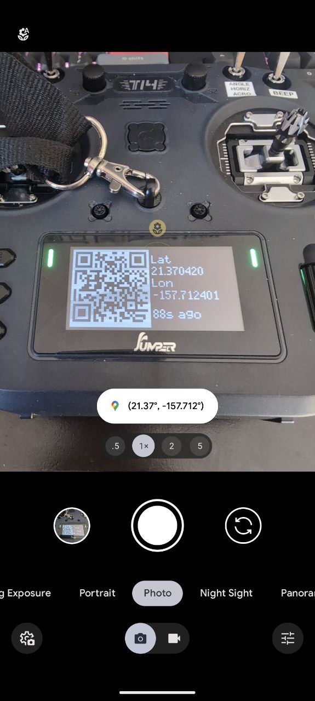
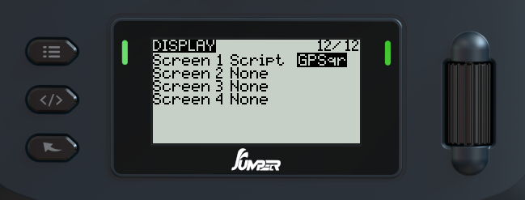

# EdgeTX GPS QR Code lua script

Have you lost your GPS-enabled quad in the field, but typing the GPS coordinates into your phone is too much work? This script will generate a QR code that you can scan with your phone and open it in your favorite map app.

Note: On this screenshot the camerapp has shortened the coordinates, but after tapping it Google Maps uses the full 6 digits (11cm accuracy) of the latitude and longitude.

The QR code is updated every 15 seconds while the script is active.

## Compatibility

This script should be compatible with monochrome EdgeTX radios, that support telemetry scripts. I have only tested it on the Jumper T14 (128x64 OLED screen, EdgeTX v2.10.0), so your mileage may vary.

> [!CAUTION]
> Generating a QR code with a Lua script is taxing on the MCU. Please do not have this telemetry screen open while in flight, as it may cause the radio to lag or crash.
>
> The script saves the last position in the background, so you can open it only when you are looking for your quad.

## Installation

> [!NOTE]
> Please do not use `gps_qr.src.lua` from this repo directly, it requires minification. 

Go to the [Releases tab](https://github.com/alufers/edgetx-gps-qrcode/releases) and download one of the following files:

| File  | Description |
| ----  | ----------- |
| GPSqr | Non-inverted version, use for LCD based monochrome radios |
| GPSqrI | Color inverted version, use for OLED based monochrome radios |

Then, copy the file to the `SCRIPTS/TELEMETRY` folder on your SD card.

## Usage

1. Make sure your model supports telemetry, and has a GPS receiver.
2. Make sure the GPS sensor is discovered by EdgeTX (Telemetry tab of the model settings). [See the EdgeTX user manual for more information](https://manual.edgetx.org/bw-radios/model-select/telemetry)
3. Add this script as a screen 
4. When you need to find your model, activate the telemtry screen and scan the QR code with your phone.
6. Go to the pin!

## Hacking

If you want to modify the script:

1. Install [luamin](https://github.com/mathiasbynens/luamin) and GNU make. (Alternatively you can manuallt use the [online version](https://mothereff.in/lua-minifier) of luamin)
2. Edit `gps_qr.src.lua`
3. Run `make` to minify the script
4. The minified script will be placed in the `dist/` folder (and the inverted version)

## Todo

While the script is functional, some improvements could be made:

- Code-golf the QR code generation further to make it faster & consume less memory
    - Idea: Generate the mask variants asycnhronously to distribute the load and allow the GC to cleanup
- Color radio support (I don't have one, so somebody else has to do it)
- Rewrite the QR code generation to C++ and contribute it to EdgeTX
    - QR code generation consists mainly of bitwise operations, which LUA sucks at - strings of 0s and 1s are used to manipulate the data, which is hopelessly inefficient
    - The error correction relies heavily on lookup tables, which in C++ could be stored in the flash memory and not in RAM like in LUA
    - This could probably be useful for other scripts as well - imagine ExpressLRS showing you one to join it's Wi-Fi network.

## Acknowledgements

This script is based on the [luaqrcode](https://github.com/speedata/luaqrcode) library licensed under the BSD 3-Clause License. See the top of [gps_qr.src.lua](gps_qr.src.lua) for the modifications that were done.

## License

[BSD 3-Clause License](LICENSE.md)
